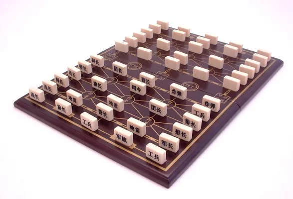
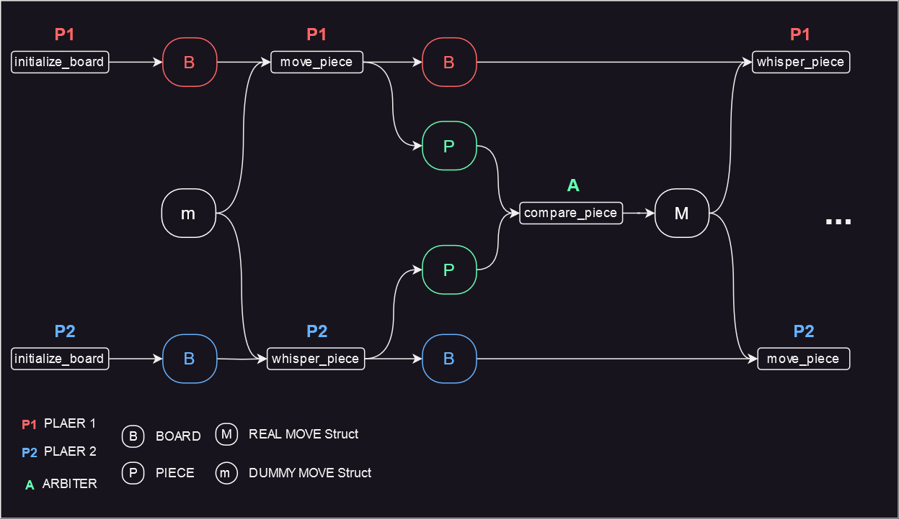

- [Summary](#summary)
- [Build and Run Guide](#build-and-run-guide)
- [Aleo Program Design](#aleo-program-design)

# Summary
Land Battle Chess is a two-player Chinese board game. It is an abstract strategy game of incomplete information, since each player has only limited knowledge concerning the disposition of the opposing pieces.
The rules are complicated; for more details, please refer to [Wikipedia](https://en.wikipedia.org/wiki/Luzhanqi). 

# Build and Run Guide

env

- snarkos 

  - https://github.com/AleoHQ/snarkOS.git [testnet3 9b8191327c0002ea7abb4252e21b4bff5b074700]

- leo

  - https://github.com/AleoHQ/leo [testnet3 a2551132f52091567a765107724746e0a6f0e39c]

- rust 

  ```bash
  rustup -V
  cargo -V
  cargo add wasm-pack
  ```

- node

  ```bash
  node -v
  v16.20.2
  ```

  

 setup

- Use  snarkOS version to build a local chain.

  ```bash
  snarok start --beacon "" --nodisplay --dev 0
  ```

- Build and Deploy the program based on the specific leo version

  ```bash
  #build land_battle_chess_aleo program
  git clone git@github.com:zksprint/land_battle_chess_aleo.git
  cd land_battle_chess_aleo && git pull 
  leo build
  
  #deploy it to testnet3
  snarkos developer deploy --query "http://127.0.0.1:3030" --private-key APrivateKey1zkp8CZNn3yeCseEtxuVPbDCwSyhGW6yZKUYKfgXmcpoGPWH --path ./build --broadcast "http://127.0.0.1:3030/testnet3/transaction/broadcast" --fee 1 --record  "{  owner: aleo1rhgdu77hgyqd3xjj8ucu3jj9r2krwz6mnzyd80gncr5fxcwlh5rsvzp9px.private,  microcredits: 93750000000000u64.private,  _nonce: 6886137302873465030715311586140142512237913705723767478581818713532726333104group.public}" land_battle_chess_v2.aleo
  
  #build land-battle-chess-rs
  git clone git@github.com:cryptodegen101/land-battle-chess-rs.git
  cd land-battle-chess-rs && git pull 
  cargo run build --release
  
  #build wasm and sdk and land-chess-ui
  git clone git@github.com:zksprint/land-chess-ui.git
  cd land-chess-ui && git pull
  #build  wasm
  cd aleo/wasm && wasm-pack build --target web
  #build sdk
  cd ../sdk && npm i
  #build  land-chess-ui
  cd ../../ && npm i 
  
  ```
  

run project

```bash
#run land-battle-chess-rs
cd lan-battle-chess-rs && cargo run --bin land-battle-chess-rs
#run land-chess-ui
cd ../land-chess-ui && npm run dev
```


# Aleo Program Design 

In the game, there are 3 parties: player1, player2 and the arbiter. When a piece lands on a space occupied by an opposing piece, the arbiter is responsible for comparing pieces. The lower-ordered piece is removed from the board; if the two are of equal order, both are to be removed from the board.



